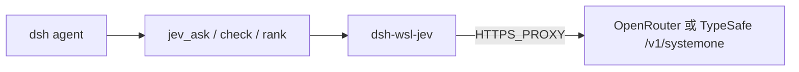

# dsh-wsl-jev

> **语言：** **中文**（本页） · [English](./README.en.md)

> **套件位置：** [dsh-wsl-kit](https://github.com/173787247/dsh-wsl-kit) 的**可选**插件，不在 `KIT_SET=daily` / `install.sh`。

DeepSeek Harness（WSL）插件：调用 **TypeSafe Jev**（System One）做结构化判断——`noul` / `choice` / `score`，**不生成长文**。

**自包含。** 不依赖第三方 Jev dsh/MCP 插件；直接打 OpenRouter 或 TypeSafe HTTP。

## 链路



## 兼容性

| 字段 | 值 |
|------|-----|
| **插件** | `dsh-wsl-jev` **0.1.0** |
| **最低 dsh** | ≥ **0.1.2** |
| **最新验证** | 以 [dsh-wsl-kit 兼容性](https://github.com/173787247/dsh-wsl-kit#compatibility-2026-09) 为准（当前 **`0.1.7-alpha.2`**）— 套件唯一真源 |
| **套件** | 可选（不在 `install.sh`） |
| **API** | 优先 `OPENROUTER_API_KEY`，否则 `TYPESAFE_API_KEY` |

## 工具

| 工具 | 作用 |
|------|------|
| `jev_status` | provider / endpoint / 是否有 key / 代理 |
| `jev_ask` | 对 `state` 提 typed 问题 |
| `jev_check` | 单题 noul：证据是否支持 claim |
| `jev_rank` | 从候选里选最贴合 query 的一项 |

## 配置 / 环境变量

```yaml
- id: dsh-wsl-jev
  name: dsh-wsl-jev
  config:
    enabled: true
    provider: auto          # auto | openrouter | typesafe
    model: jev-latest
    timeoutMs: 15000
```

```sh
# ~/.dsh/dsh-wsl-jev.env  （kit 的 restart-dsh-web.sh 会 source）
OPENROUTER_API_KEY=sk-or-...
# 或: TYPESAFE_API_KEY=...
# DSH_JEV_MODEL=jev-latest
```

WSL 通常需要 `HTTPS_PROXY`（与 IM / fetch 相同）。

## 安装

```sh
dsh plugin --profile web add github:173787247/dsh-wsl-jev
bash ~/path/to/dsh-wsl-kit/scripts/restart-dsh-web.sh
```

新会话：先 `jev_status`，再 `jev_check`（claim 建议用短英文）。

## 协议

见 [docs/PROTOCOL.md](./docs/PROTOCOL.md)。

## 冒烟（CLI）

```sh
bash scripts/probe-jev.sh
```

## License

MIT
