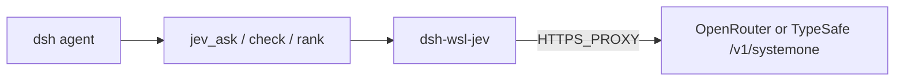

# dsh-wsl-jev

> **Install set:** optional companion to [dsh-wsl-kit](https://github.com/173787247/dsh-wsl-kit). Not in `KIT_SET=daily`.

DeepSeek Harness WSL plugin: call **TypeSafe Jev** (System One) for structured decisions �`noul` / `choice` / `score`. No prose generation.

**Self-contained.** Does not depend on third-party Jev dsh/MCP plugins. Speaks OpenRouter or TypeSafe HTTP directly.

[中文说明 �README.zh.md](./README.zh.md)

## Architecture



## Compatibility

| Field | Value |
|-------|-------|
| **Plugin** | `dsh-wsl-jev` **0.1.0** |
| **Minimum dsh** | �**0.1.2** |
| **Kit set** | optional (not in `install.sh`) |
| **API** | `OPENROUTER_API_KEY` (preferred) or `TYPESAFE_API_KEY` |

## Tools

| Tool | Role |
|------|------|
| `jev_status` | Provider, endpoint, key present?, proxy |
| `jev_ask` | Typed questions over a `state` |
| `jev_check` | One `noul`: is claim supported by evidence? |
| `jev_rank` | Pick best candidate for a query |

## Config / env

```yaml
- id: dsh-wsl-jev
  name: dsh-wsl-jev
  config:
    enabled: true
    provider: auto          # auto | openrouter | typesafe
    model: jev-latest
    timeoutMs: 15000
```

```sh
# ~/.dsh/dsh-wsl-jev.env  (sourced by kit restart-dsh-web.sh)
OPENROUTER_API_KEY=sk-or-...
# or: TYPESAFE_API_KEY=...
# DSH_JEV_MODEL=jev-latest
```

WSL has no reliable direct egress to these hosts �keep `HTTPS_PROXY` set (same as IM / fetch).

## Install

```sh
dsh plugin --profile web add github:173787247/dsh-wsl-jev
bash �dsh-wsl-kit/scripts/restart-dsh-web.sh
```

New session: `jev_status`, then `jev_check` with a short English claim.

## Smoke (CLI)

```sh
bash scripts/probe-jev.sh
```

## License

MIT
