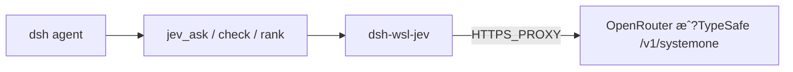

# dsh-wsl-jev

> **安装集：** [dsh-wsl-kit](https://github.com/173787247/dsh-wsl-kit) �选伴侣，�在 `KIT_SET=daily` / `install.sh`�

DeepSeek Harness WSL �件：调�**TypeSafe Jev**（System One）�结�化判断（`noul` / `choice` / `score`），**�生�长�*�

**自建�零第三�Jev �件�赖�* 直��OpenRouter �TypeSafe HTTP�

[English �README.md](./README.md)

## 链路



## 工具

| 工具 | 作用 |
|------|------|
| `jev_status` | �provider / endpoint / 是��key / 代� |
| `jev_ask` | �`state` �若�typed 问题 |
| `jev_check` | �题 noul：��是�支�claim |
| `jev_rank` | �候选里选最�query 的一�|

## 凭�

优先 `OPENROUTER_API_KEY`，��`TYPESAFE_API_KEY`。�放进 `~/.dsh/dsh-wsl-jev.env`（kit �`restart-dsh-web.sh` �source）。WSL 需 `HTTPS_PROXY`�

## 安装

```sh
dsh plugin --profile web add github:173787247/dsh-wsl-jev
bash �dsh-wsl-kit/scripts/restart-dsh-web.sh
```

新会�：`jev_status` �`jev_check`�

## License

MIT
