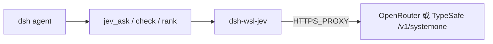

# dsh-wsl-jev

> **安装集：** [dsh-wsl-kit](https://github.com/173787247/dsh-wsl-kit) 可选伴侣，不在 `KIT_SET=daily` / `install.sh`。

DeepSeek Harness WSL 插件：调用 **TypeSafe Jev**（System One）做结构化判断（`noul` / `choice` / `score`），**不生成长文**。

**自建、零第三方 Jev 插件依赖。** 直接打 OpenRouter 或 TypeSafe HTTP。

[English → README.md](./README.md)

## 链路



## 工具

| 工具 | 作用 |
|------|------|
| `jev_status` | 看 provider / endpoint / 是否有 key / 代理 |
| `jev_ask` | 对 `state` 提若干 typed 问题 |
| `jev_check` | 单题 noul：证据是否支持 claim |
| `jev_rank` | 从候选里选最贴 query 的一项 |

## 凭证

优先 `OPENROUTER_API_KEY`，否则 `TYPESAFE_API_KEY`。可放进 `~/.dsh/dsh-wsl-jev.env`（kit 的 `restart-dsh-web.sh` 会 source）。WSL 需 `HTTPS_PROXY`。

## 安装

```sh
dsh plugin --profile web add /mnt/c/Users/rchua/Desktop/AIFullStackDevelopment/dsh-wsl-jev
bash …/dsh-wsl-kit/scripts/restart-dsh-web.sh
```

新会话：`jev_status` → `jev_check`。

## License

MIT
